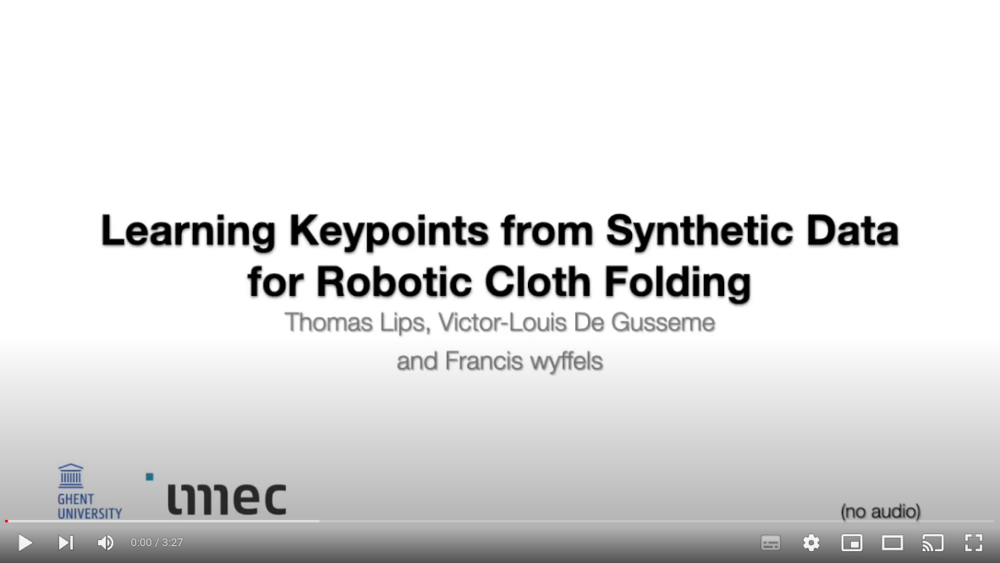

# Learning Keypoints from Synthetic Data for Robotic Cloth Folding
This repo contains the code and all results for a submission for the ICRA 2022 workshop on Deformable Object Manipulation.

In this work we learn a keypoint detector to perform cloth folding. We use procedural data generation to train a convolutional neural network from synthetic data, enabling low-cost data collection. We evaluate the performance of this network on a unimanual robot setup for folding towels
and find that the grasp and fold success rates are 77% and 53%, respectively. We conclude that learning keypoint detectors from synthetic data for such tasks is a promising research direction, discuss some failures and relate them to future work.

All images from the evaluation can be found [here](https://drive.google.com/drive/folders/1elHCrpqfmvJ7Hl9XkIkyx2jKimwhHobV?usp=sharing).

The code base contains 3 parts:
- code for the procedural data generation of the data, located in `data-generation/`
- code to define the convolutional neural network and training procedure, located in `keypoints/`
- code that controls the robot, defines the trajectories and captures images from the camera to fold the towels, located in `robot/`

Below, the instructions are listed to reproduce these 3 parts or to use the pretrained weights. Apologies for the lengthy setup instructions, a docker container is on its way..

## Data Generation

To generate synthetic images of unfolded cloths, we make use of [Blender](https://www.blender.org/), version 3.0.1
Additionally, we use the excellent [BlenderProc](https://github.com/DLR-RM/BlenderProc) library and our own [Blender-toolbox](https://github.com/airo-ugent/airo-blender-toolkit).
### Local Installation
- download [blender 3.0](https://download.blender.org/release/Blender3.0/) (which comes with its own python distribution) and unzip the file.
- pip install [vcs-tool](https://github.com/dirk-thomas/vcstool) using `sudo pip install vcstool`
- in the `data-generation` folder, clone the unreleased dependencies using `vcs import data-generation < data-generation/blender_dependencies.repos`
- `cd <path-to-blender>/blender-3.0.1-linux-x64/3.0/python/bin`
- run `./python3.9 -m ensurepip` to make sure pip is installed in the blender python distribution
- pip install BlenderProc and the Airo-Blender-Toolkit within the blender python distribution using `pip install /<location-of-this-repo>/data-generation/blenderproc` and `pip install /<location-of-this-repo>/data-generation/airo_blender_toolkit`.
- pip install the towel package in this repo in the blender python distribution using `pip install -e <location-of-this-repo>/data-generation/towel`
- download the textures and HDRIs, using `python data-generation/utils/fetch_blender_polyhaven_assets.py`
- download the Thingi10K distractor objects with `python data-generation/utils/Thingi10K_genus_lt_3.py --output ./assets/thingi10`, do not forget to create this directory first.

### Data generation
- to create a scene, run `/<path-to-blender>/blender-3.0.1-linux-x64/./blender --python data-generation/towel/towel/generate_towel_scene.py` from the root of this repository. Blender will now open and you should see the scene.
- to generate the entire dataset used in this work, run `<path-to-blender>/blender-3.0.1-linux-x64/./blender --python data-generation/towel/towel/generate_dataset.py -- --amount_of_samples 30000 --resolution 256 --start_seed 0`. By default the dataset will be created in `home/datasets` but  this can be changed if desired.

## Keypoint Detection
The keypoint detection code can be found here: https://github.com/tlpss/keypoint-detection

### Local Installation
- git clone the repo `git clone https://github.com/tlpss/keypoint-detection#c793f3cf6d803d942054a36ae9b44c410cffa2b3` in the `keypoints` folder.
- Follow the instructions at https://github.com/tlpss/keypoint-detection to install the dependencies.

### CNN
- To train on the dataset created: `python /keypoints/keypoint-detection/keypoint_detection/train/train.py --ap_epoch_freq=5 --ap_epoch_start=5 --auto_select_gpus=True --backbone_type=Unet --batch_size=64 --early_stopping_relative_threshold=-0.01 --gpus=1 --heatmap_sigma=2 --image_dataset_path=<path-to-dataset> --json_dataset_path=<path-to-dataset>/dataset.json --keypoint_channel_max_keypoints=4 --keypoint_channels=corner_keypoints_visible --learning_rate=0.0003 --log_every_n_steps=20 --lr_scheduler_relative_threshold=0.005 --max_epochs=16 --maximal_gt_keypoint_pixel_distances="2 4" --minimal_keypoint_extraction_pixel_distance=30 --n_channels=32 --n_downsampling_layers=2 --n_resnet_blocks=16 --num_sanity_val_steps=1 --num_workers=4 --precision=32 --validation_split_ratio=0.1 --wandb_entity <your-wandb-profile>`
- All training details, as well as the model checkpoints can be found at https://wandb.ai/tlips/icra-2022-workshop/runs/2qand21y?workspace=user-tlips.
- To use the trained model for inference, see below.

## Robot
### Local installation
- get yourself a UR3e, ZED2i and Robotiq-2F85 gripper. If you have different hardware, you will need to cherry-pick the relevant parts of the code in the `robot/` folder.
- print 2 fingers using Flexfill-98 TPU filament. The .stl file can be found under `static/cad/`
- pip install opencv2: `pip install opencv-contrib-python==4.5.5.64`
- clone the unreleased dependencies using `vcs import robot < robot/blender_dependencies.repos`
- pip install them in the same conda environment as the keypoint detection code

## Robotic Folding
- determine your camera extrinsics using an Aruco marker and the `marker_pose_to_pickle.py` file, this will create a `marker.pickle` file.
- Measure the position of your marker to the robot base frame manually and update the code at line 11 of `robot/robot_script.py`. Orientations are not supported so make sure to allign the marker to the base frame of the robot.
- to manually mark the keypoints (to test the trajectories): `python robot/manual_keypoints.py`
- to detect the keypoints using the pretrained weights and exectute the fold: `python robot/detect_keypoints_and_fold.py`
