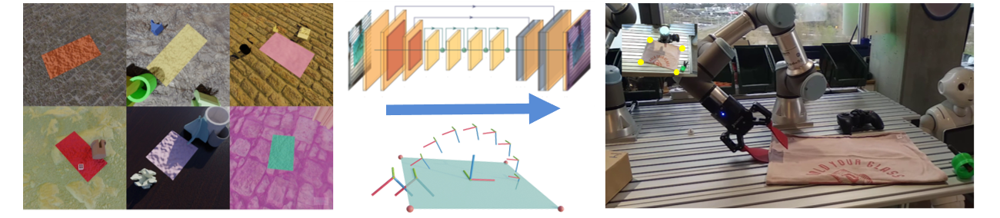
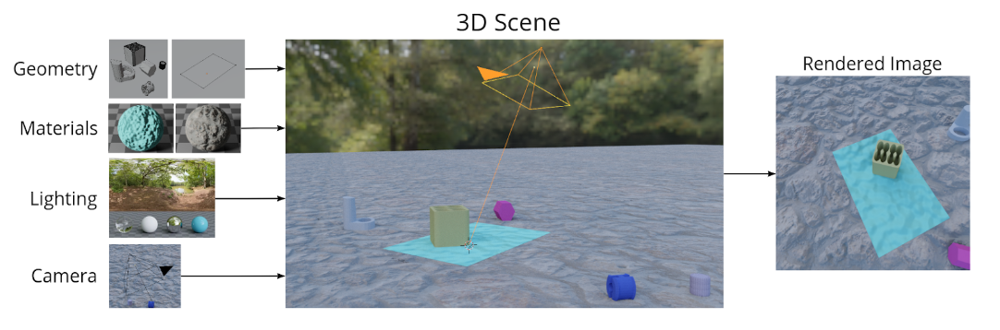

<h1 align="center">Learning Keypoints from Synthetic Data

for Robotic Cloth Folding </h1>


<p align="center">
  <a href="https://www.tlips.be">Thomas Lips</a>,
  <a href="https://github.com/Victorlouisdg">Victor-Louis De Gusseme</a>,
  <a href="https://airo.ugent.be/members/francis/">Francis wyffels</a>
  <br/>
  <a href="https://www.imperial.ac.uk/dyson-robotics-lab/">AI and Robotics Lab (AIRO) </a>,
  <a href="https://www.ugent.be/">Ghent University</a>
  <br/>
  2nd workshop on Representing and Manipulating Deformable Objects (<a href="https://deformable-workshop.github.io/icra2022/">RMDO</a>) <br/>
  IEEE International Conference on Robotics and Automation (ICRA), 2022
</p>


<div align="center">
  
</div>

<p align="center">
  <a href="https://arxiv.org/abs/2205.06714"><b>Paper</b></a> |
  <a href="https://biblio.ugent.be/publication/8755606/file/8755643.pdf"><b>Poster</b></a> |
  <a href="https://youtu.be/EVAXd6waVqg?t=6065"><b>Spotlight Talk</b></a> |
  <a href="https://www.youtube.com/watch?v=T3QdBRcC2NY"><b>Technical Video</b></a>


</p>


In this work we learn to detect the corners of cloth items. We use procedural data generation to train a convolutional neural network from synthetic data, enabling low-cost data collection. We evaluate the zero-shot performance of this network on a unimanual robot setup for folding towels
and find that the grasp and fold success rates are 77% and 53%, respectively. We conclude that learning keypoint detectors from synthetic data for such tasks is a promising research direction, discuss some failures and relate them to future work.

---


The codebase has 3 main components:

<a href="#data-generation">Procedural Data Generation</a>

<a href="#keypoint-detection">Keypoint Detection</a>

<a href="#Robot">Robot Folding</a>


We also provide the pretrained weights and all training logs.

## Data Generation

To generate synthetic images of unfolded cloths, we make use of [Blender](https://www.blender.org/), version 3.0.1
Additionally, we use the excellent [BlenderProc](https://github.com/DLR-RM/BlenderProc) library and our own [Blender-toolbox](https://github.com/airo-ugent/airo-blender-toolkit). The pipeline is shown in the figure below, for more details we refer to the paper.
<div align="center">
  
</div>

### Local Installation
- run `cd data-generation && bash setup.sh` to install blender and the dependencies, as well as to download all the assets (might take a while).

### Data generation
- to create a scene, run `blender-3.0.1-linux-x64/./blender --python data-generation/towel/towel/generate_towel_scene.py` in the data-generation folder of this repository. Blender will now open and you should see the scene.
- to generate the entire dataset used in this work, run `/blender-3.0.1-linux-x64/./blender --python data-generation/towel/towel/generate_dataset.py -- --amount_of_samples 30000 --resolution 256 --start_seed 0`. By default the dataset will be created in `home/datasets` but  this can be changed if desired.

## Keypoint Detection
The keypoint detection code can be found here: https://github.com/tlpss/keypoint-detection

### Local Installation
- git clone the repo at the specific commit using `git clone https://github.com/tlpss/keypoint-detection && git checkout c793f3cf6d803d942054a36ae9b44c410cffa2b3` in the `keypoints` folder.
- Follow the instructions at https://github.com/tlpss/keypoint-detection to install the dependencies.

### CNN
- To train on the dataset created: `python /keypoints/keypoint-detection/keypoint_detection/train/train.py --ap_epoch_freq=5 --ap_epoch_start=5 --auto_select_gpus=True --backbone_type=Unet --batch_size=64 --early_stopping_relative_threshold=-0.01 --gpus=1 --heatmap_sigma=2 --image_dataset_path=<path-to-dataset> --json_dataset_path=<path-to-dataset>/dataset.json --keypoint_channel_max_keypoints=4 --keypoint_channels=corner_keypoints_visible --learning_rate=0.0003 --log_every_n_steps=20 --lr_scheduler_relative_threshold=0.005 --max_epochs=16 --maximal_gt_keypoint_pixel_distances="2 4" --minimal_keypoint_extraction_pixel_distance=30 --n_channels=32 --n_downsampling_layers=2 --n_resnet_blocks=16 --num_sanity_val_steps=1 --num_workers=4 --precision=32 --validation_split_ratio=0.1 --wandb_entity <your-wandb-profile>`
- All training details, as well as the model checkpoints can be found at https://wandb.ai/tlips/icra-2022-workshop/runs/2qand21y?workspace=user-tlips.
- To use the trained model for inference, see below.

## Robot
### Local installation
- This work uses a UR3e, ZED2i and Robotiq-2F85 gripper. If you have different hardware, you will need to handpick the relevant parts of the code in the `robot/` folder.
- print 2 fingers using Flexfill-98 TPU filament. The .stl file can be found under `static/cad/`
- pip install opencv2: `pip install opencv-contrib-python==4.5.5.64` in the conda environment of the keypoint detection code
- clone the unreleased dependencies using `vcs import robot < robot/dependencies.repos`
- pip install them in the same python environment as the keypoint detection code

### Robotic Folding
- determine your camera extrinsics using an Aruco marker and the `marker_pose_to_pickle.py` file, this will create a `marker.pickle` file.
- Measure the position of your marker to the robot base frame manually and update the code at line 11 of `robot/robot_script.py`. Orientations are not supported so make sure to allign the marker to the base frame of the robot.
- to manually mark the keypoints (to test the trajectories): `python robot/manual_keypoints.py`
- to detect the keypoints using the pretrained weights (`model.ckpt`) and exectute the fold: `python robot/detect_keypoints_and_fold.py`

All images from the evaluation can be found [here](https://drive.google.com/drive/folders/1elHCrpqfmvJ7Hl9XkIkyx2jKimwhHobV?usp=sharing).


## Citation
```
@inproceedings{lips2022synthkeypoints,
  title={Learning Keypoints from Synthetic Data for Robotic Cloth Folding},
  author={Lips, Thomas and De Gusseme, Victor-Louis and others},
  journal={2nd workshop on Representing and Manipulating Deformable Objects - ICRA},
  year={2022}
}
```
